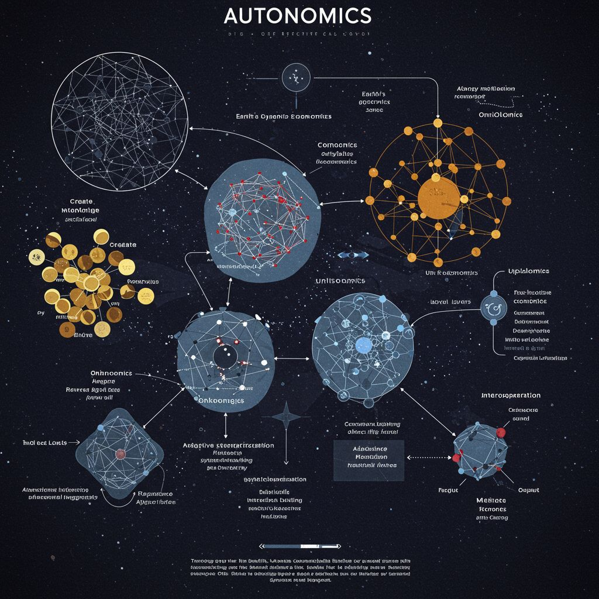

# 可能性演化的可视化

多原因路径演化（平面）

球面

菜花模样的，非常类似于时空路径推演装置。只不过**菜花球用了更加立体的形式来表达。这种表达很符合沉侵式视觉体验的表达逻辑**

这是一个使用星空图来描绘自动驾驶相关信息要素、知识要素和物理零件要素的信息图。它可以看作是对菜花球的另一种解释，左侧金色的爆炸图说的是某个星球的各种状态，它们可以被看成是状态的**花簇形状的集合。**中间较大的是**智能生成**小宇宙，稍微小一点的是**本体体系**意思是它旁边小宇宙所需要的知识。其他还包括**计算单元**小宇宙、**资源体系**小宇宙、**关联关系**小宇宙等等。

宇宙-地球时空推演

