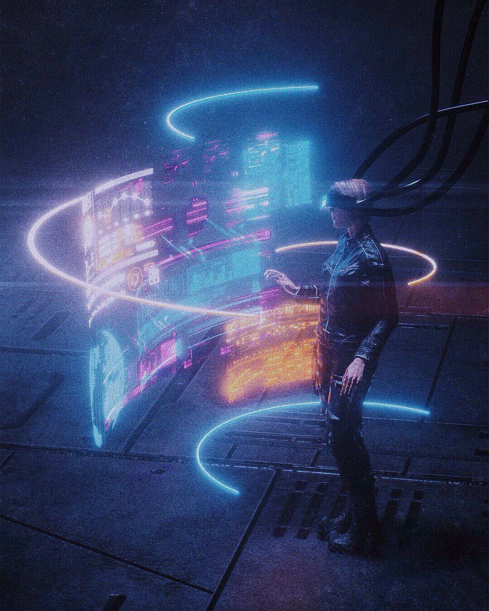

# 总结

## 1、多层虚拟屏幕

## 2、这些屏幕的内容是基于事件的时空推演后自动形成的

图中的每一个点代表一个屏幕

## 3、通过虚拟“飞行”在不同的3D视觉空间中穿梭，并完成事件追踪/因果推理/业务判断/行动决策

纯文字版本：

# 总结

## 1、多层虚拟屏幕

文档中嵌入了一张图片，展示了一个在黑暗环境中操作多层虚拟屏幕的场景。画面中央，一个戴着增强现实（或虚拟现实）头显的短发人物（可能是女性）站在一个充满科技感的金属地板上。在她面前，多层发光的、半透明的虚拟屏幕以弧形排列，显示着各种数据、图表和界面元素。这些屏幕发出蓝色和橙色的光芒，并被几条明亮的霓虹灯线条环绕。人物伸出右手，似乎正在与这些虚拟屏幕进行交互，整个场景营造出一种沉浸式的未来工作或探索氛围。

## 2、这些屏幕的内容是基于事件的时空推演后自动形成的

图中的每一个点代表一个屏幕

文档中嵌入了一张图片，展示了一个抽象的、球形结构。这个球体由无数个小的、发光的绿色或黄色圆点（点状簇）组成，这些点通过细线相互连接，形成一个复杂的、分形生长的网络。整个结构悬浮在一个纯黑色的背景中，并被几条细长的绿色弧线环绕，暗示这是一个3D空间中的数据可视化。每个点簇可能代表一个“屏幕”或信息节点，共同构成一个庞大的信息网络。

## 3、通过虚拟“飞行”在不同的3D视觉空间中穿梭，并完成事件追踪/因果推理/业务判断/行动决策

文档中嵌入了一张图片，展示了一个未来感十足的驾驶舱或控制中心。画面中央是一个穿着紧身科技感服装的女性角色（可能是飞行员或操作员），她的头部戴着某种头戴式显示器或通信设备。她身处一个被蓝色全息屏幕和界面包围的环境中，屏幕上显示着各种数据、图表和复杂的控制界面。她的右手向前伸出，似乎正在空中操作一个虚拟界面，掌心发光，仿佛在激活或控制什么。整个场景充满了高科技和沉浸感，暗示着对复杂系统的实时控制和决策。