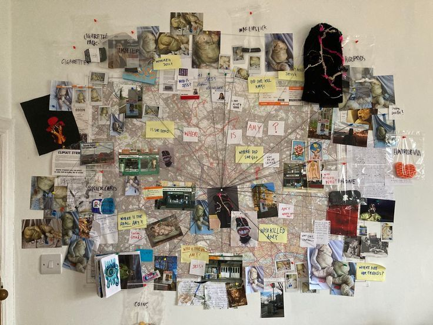

# 时空推演与飞行

先从影视剧中的犯罪推理板开始，侦探们通过证据可视化来推理案情

这个是装置艺术，可以理解为它将“推理板”3D化了

这个是将因果链条，or 时间关系组织梳理出来的样子

ok，如果一个港口，或者一个特定的技术领域，它的场景和可能的因果关系体系是可以被组织起来的。

我们运用时空推演，就可以将不同的事件用时间关系串联成一个事件主导的链条。比如雨滴落地的“事件”链条

那么如果这些事件及其事件包含的信息空间被记录下来，并被组织好，类似这样：

那么，只要侦探们只要在这个被组织好的时空隧道里就能够很容易的发现问题并解决问题

主观视角，可能是这种样子。即你可以站在时光隧道中，空间与事件被一一悬挂在隧道周围：

你只要愿意，就可以通过手势，进入特定的事件时空对应的信息空间里观察事件

