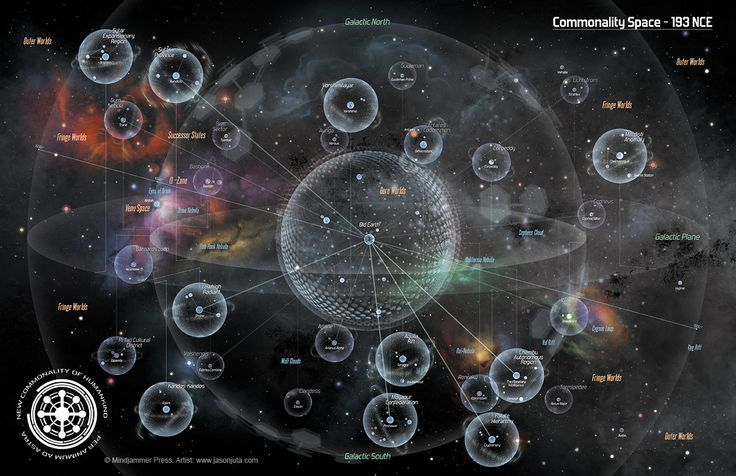

# 第三人称视角/鸟瞰视角

这张图表达的是可能性的多个层级，最里面的是当前你的所有可能性（你在中心点，你是教师。你的世界充满了学校、班级、考试、生生等等要素）。某些可能性会构成更完整的子系统（可以理解为如果你做了艺术家，那么艺术家的世界就是一个新的“小球”，一数据会在那个小球里独立发展出自己的人生）

**它和菜花球想要表达的含义是一致的**。

这两张张可以理解为一个独立小球的对象构成，比如音乐厅、练琴房、钢琴曲、油画等等

电影《普罗米修斯》的一个桥段：工程师启动宇宙导航片段。这是典型的宏观第三者视角

### 本位or当前世界的第三者视角

职责是经典的3D展示第三者视角

电影《普罗米修斯》的一个桥段：飞船放出的扫描小蜜蜂传回来的洞穴感知3D画面。这也是第三者视角

这也是第三者视角

